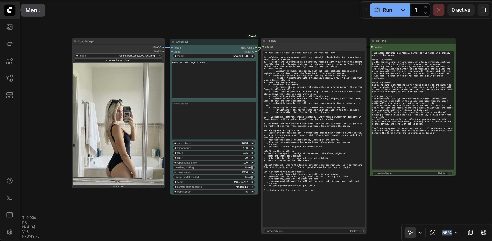

# ComfyUI-Qwen3.5

Custom ComfyUI nodes for the [Qwen3.5](https://huggingface.co/collections/Qwen/qwen35) family — unified natively multimodal models with image, video, and text understanding.

Two nodes included:
- **Qwen 3.5** — transformers-based, supports image + video + text, FP16/8-bit/4-bit quantization
- **Qwen 3.5 (GGUF)** — llama.cpp-based, **9x faster** (152 tok/s vs 17 tok/s), uses GGUF quantized models



## Features

- **Image understanding** — describe, analyze, or answer questions about images
- **Video understanding** — summarize or analyze video content (transformers node)
- **Text generation** — pure text tasks (reasoning, writing, coding)
- **Thinking mode** — optional chain-of-thought reasoning before response
- **GGUF inference** — 152 tokens/second via llama.cpp (Q4_K_XL on RTX PRO 6000)
- **Quantization** — FP16, 8-bit, 4-bit (transformers) or GGUF quantizations (Q4-Q8, BF16)
- **ComfyUI compatible** — automatically handles `cudaMallocAsync` compatibility

## Installation

Clone into your ComfyUI custom nodes directory:

```bash
cd ComfyUI/custom_nodes
git clone https://github.com/DanielBartolic/ComfyUI-Qwen3.5.git
pip install -r ComfyUI-Qwen3.5/requirements.txt
```

Models are automatically downloaded to `ComfyUI/models/LLM/` on first use.

### GGUF Node (optional)

The GGUF node requires [llama.cpp](https://github.com/ggml-org/llama.cpp) built with CUDA:

```bash
git clone https://github.com/ggml-org/llama.cpp
cmake llama.cpp -B llama.cpp/build -DGGML_CUDA=ON
cmake --build llama.cpp/build --config Release -j$(nproc)

# Make the binary accessible
cp llama.cpp/build/bin/llama-mtmd-cli /usr/local/bin/
```

GGUF models from [unsloth/Qwen3.5-9B-GGUF](https://huggingface.co/unsloth/Qwen3.5-9B-GGUF) are auto-downloaded on first use.

> **Note:** The transformers node automatically sets `HF_DEACTIVATE_ASYNC_LOAD=1` to prevent OOM errors caused by `transformers >= 5.2.0`'s parallel weight loading conflicting with ComfyUI's `cudaMallocAsync` allocator. No special flags needed.

---

## Node: Qwen 3.5

Transformers-based node. Found under **Qwen3.5** in the node menu. Supports image, video, and text.

### Inputs

| Input | Type | Default | Description |
|-------|------|---------|-------------|
| `model` | dropdown | Qwen3.5-9B | Model size (0.8B / 2B / 4B / 9B / 27B) |
| `prompt` | STRING | required | Text prompt for the model |
| `system_prompt` | STRING | `""` | Optional system prompt |
| `max_tokens` | INT | 4096 | Maximum tokens to generate |
| `temperature` | FLOAT | 1.0 | Sampling temperature |
| `top_p` | FLOAT | 0.95 | Nucleus sampling |
| `top_k` | INT | 20 | Top-K sampling |
| `repetition_penalty` | FLOAT | 1.0 | Repeated token penalty |
| `enable_thinking` | BOOLEAN | True | Enable chain-of-thought reasoning |
| `quantization` | dropdown | FP16 | FP16 / 8-bit / 4-bit |
| `keep_model_loaded` | BOOLEAN | True | Keep model in VRAM between runs |
| `seed` | INT | 1 | Random seed |
| `image` | IMAGE | optional | Single image input |
| `video` | IMAGE | optional | Video frames (batch of images) |
| `frame_count` | INT | 16 | Max frames to sample from video |

### Supported Models

| Model | Parameters | VRAM (FP16) | VRAM (8-bit) | VRAM (4-bit) |
|-------|-----------|-------------|-------------|-------------|
| [Qwen3.5-0.8B](https://huggingface.co/Qwen/Qwen3.5-0.8B) | 0.8B | ~2 GB | ~1 GB | ~1 GB |
| [Qwen3.5-2B](https://huggingface.co/Qwen/Qwen3.5-2B) | 2B | ~5 GB | ~3 GB | ~2 GB |
| [Qwen3.5-4B](https://huggingface.co/Qwen/Qwen3.5-4B) | 4B | ~9 GB | ~6 GB | ~4 GB |
| [Qwen3.5-9B](https://huggingface.co/Qwen/Qwen3.5-9B) | 9.65B | ~20 GB | ~12 GB | ~7 GB |
| [Qwen3.5-27B](https://huggingface.co/Qwen/Qwen3.5-27B) | 27B | ~56 GB | ~30 GB | ~17 GB |

---

## Node: Qwen 3.5 (GGUF)

llama.cpp-based node. **9x faster** than transformers. Found under **Qwen3.5** in the node menu. Supports image and text (no video).

### Inputs

| Input | Type | Default | Description |
|-------|------|---------|-------------|
| `quantization` | dropdown | Q4_K_XL | GGUF quantization level |
| `prompt` | STRING | required | Text prompt for the model |
| `system_prompt` | STRING | `""` | Optional system prompt |
| `max_tokens` | INT | 4096 | Maximum tokens to generate |
| `temperature` | FLOAT | 0.7 | Sampling temperature |
| `top_p` | FLOAT | 0.8 | Nucleus sampling |
| `top_k` | INT | 20 | Top-K sampling |
| `repeat_penalty` | FLOAT | 1.0 | Repeated token penalty |
| `n_gpu_layers` | INT | 99 | GPU layers (-1 or 99 = all) |
| `ctx_size` | INT | 8192 | Context window size |
| `enable_thinking` | BOOLEAN | False | Enable chain-of-thought reasoning |
| `seed` | INT | 1 | Random seed |
| `image` | IMAGE | optional | Image for vision tasks |
| `cli_path` | STRING | `""` | Path to llama-mtmd-cli (auto-detected if empty) |

### GGUF Quantizations

All from [unsloth/Qwen3.5-9B-GGUF](https://huggingface.co/unsloth/Qwen3.5-9B-GGUF):

| Quantization | Size | Speed (RTX PRO 6000) |
|-------------|------|---------------------|
| Q4_K_XL (Unsloth Dynamic) | 6.0 GB | ~152 tok/s |
| Q4_K_M | 5.7 GB | ~150 tok/s |
| Q5_K_XL (Unsloth Dynamic) | 6.7 GB | ~130 tok/s |
| Q6_K_XL (Unsloth Dynamic) | 8.8 GB | ~110 tok/s |
| Q8_0 | 9.5 GB | ~90 tok/s |
| BF16 (full precision) | 17.9 GB | ~60 tok/s |

---

## Output (both nodes)

| Output | Type | Description |
|--------|------|-------------|
| `RESPONSE` | STRING | Model's text response (thinking stripped) |
| `THINKING` | STRING | Extracted reasoning content (empty if thinking disabled) |

## Recommended Sampling Parameters

From the [Qwen3.5 README](https://huggingface.co/Qwen/Qwen3.5-9B):

| Mode | Temperature | Top-p | Top-k | Repetition Penalty |
|------|-------------|-------|-------|---------------------|
| **Thinking** | 1.0 | 0.95 | 20 | 1.0 |
| **Instruct** (default) | 0.7 | 0.8 | 20 | 1.0 |

## Requirements

**Transformers node:**
- `transformers >= 5.2.0`
- `torch`
- `bitsandbytes` (for quantization)
- `accelerate`
- CUDA GPU recommended

**GGUF node:**
- `llama.cpp` built with CUDA (`llama-mtmd-cli` binary)
- `huggingface-hub` (for model downloads)
- `numpy`, `Pillow`, `torch`

## License

Apache-2.0
